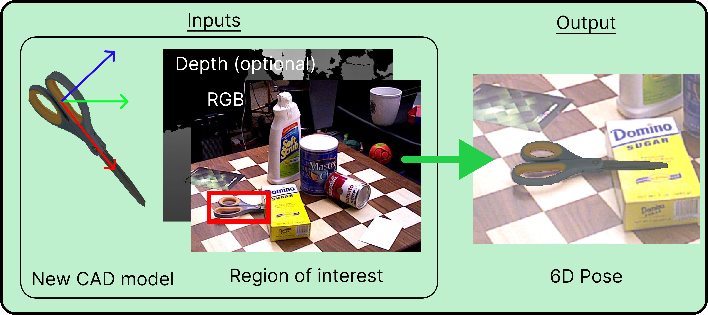
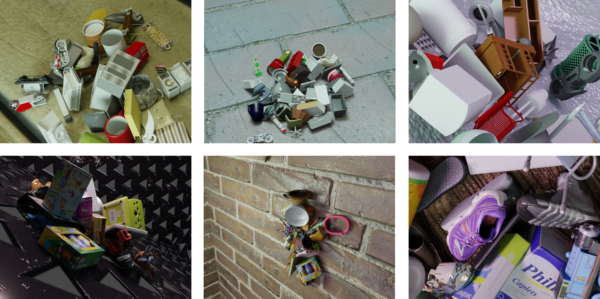
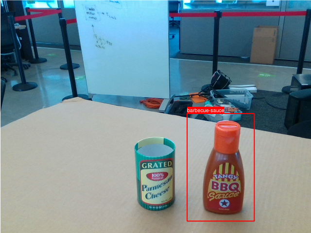
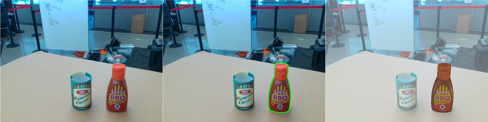
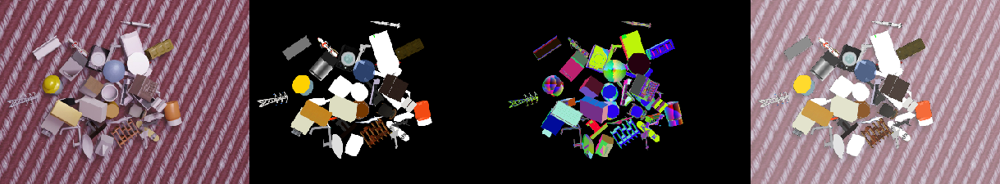
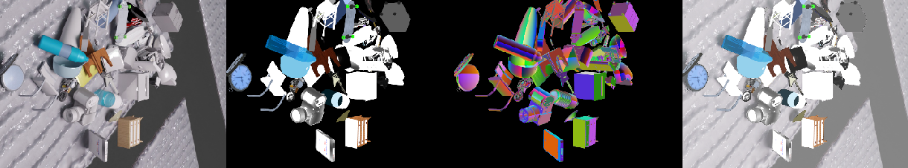

# MegaPose
This repository contains code, models and dataset for our MegaPose paper. 

Yann Labbé, Lucas Manuelli, Arsalan Mousavian, Stephen Tyree, Stan Birchfield, Jonathan Tremblay, Justin Carpentier, Mathieu Aubry, Dieter Fox, Josef Sivic. “MegaPose: 6D Pose Estimation of Novel Objects via Render & Compare.” In: CoRL 2022.

[[Paper]](https://arxiv.org/abs/2212.06870) [[Project page]](https://megapose6d.github.io/)

## News
- **09.01.2023** We released two new variants of our approach (see the [Model Zoo](#model-zoo)).
- **09.01.2023** Code, models and dataset are released in this repository.
- **10.09.2022** The paper is accepted at CoRL 2022.

## Contributors
The main contributors to the code are:
- [Yann Labbé](https://ylabbe.github.io/) (Inria, NVIDIA internship)
- [Lucas Manuelli](https://lucasmanuelli.com) (NVIDIA Seattle Robotics Lab)

## Citation
If you find this source code useful please cite:

```
@inproceedings{labbe2022megapose,
  title = {{{MegaPose}}: {{6D Pose Estimation}} of {{Novel Objects}} via {{Render}} \& {{Compare}}},
  booktitle = {CoRL},
  author = {Labb\'e, Yann and Manuelli, Lucas and Mousavian, Arsalan and Tyree, Stephen and Birchfield, Stan and Tremblay, Jonathan and Carpentier, Justin and Aubry, Mathieu and Fox, Dieter and Sivic, Josef},
  date = {2022}
}
```

# Overview
This repository contains pre-trained models for pose estimation of novel objects, and our synthetic training dataset. Most notable features are listed below.

## Pose estimation of novel objects


We provide pre-trained models for 6D pose estimation of novel objects. 

Given as inputs: 
- an RGB image (depth can also be used but is optional),
- the intrinsic parameters of the camera,
- a mesh of the object,
- a bounding box of that object in the image,

our approach estimates the 6D pose of the object (3D rotation + 3D translation) with respect to the camera. 

We provide a script and an example for inference on novel objects. After installation, please see the [Inference tutorial](#inference-tutorial).

## Large-scale synthetic dataset


We provide the synthetic dataset we used to train MegaPose. The dataset contains 2 million images displaying more than 20,000 objects from the Google Scanned Objects and ShapeNet datasets. After installation, please see the [Dataset section](#dataset).


# Installation
Once you are done with the installation, we recommend you head to the [Inference tutorial](#inference-tutorial). 

## 1. Clone the repository
The first step is to clone the repo and submodules:
```
git clone https://github.com/megapose6d/megapose6d.git
cd megapose6d && git submodule update --init
```
## 2. Set environment variables (optional)
For convenience, the MegaPose data directory can be changed by setting the environment variable `MEGAPOSE_DATA_DIR`. For example the data for the inference example will be downloaded to `MEGAPOSE_DATA_DIR/examples`. If not set manually, the directory `local_data/` under the project root will be used.

## 3. Install dependencies with conda or use the docker image
We support running `megapose` either in a [`conda`](#conda-installation) environment or in a [`docker`](#docker-installation) container. For simplicity, we recommend using `conda` if you are not running on a cloud computer. Once you are done with the installation, you can head directly to the [inference tutorial](#inference-tutorial) or [dataset usage](#dataset).

### Option A: Conda Installation

We will create a `conda` environment named `megapose` that contains all the dependencies, then install the `megapose` python package inside.

```
conda env create -f conda/environment_full.yaml
conda activate megapose
pip install -e .
```

If you plan to further develop the MegaPose code, you may want to install dev tools via `pip install -e ".[ci,dev]"`. See [here](#dev-ops) for more details.

### Option B: Docker Installation
<details>
<summary>Click for details...</summary>

### Create a conda environment
Creat a conda environment with `python==3.9`. We will use this conda environment to manage a small number of dependencies needed for 

```
conda env create -f conda/environment.yaml
```

### Install dependencies in conda

Activate the conda environment and install `job_runner` and `megapose`. Note that the `megapose` install inside `conda` is just to enable us to run the data download scripts from the host machine rather than from `docker`. Navigate to the project root, and set `MEGAPOSE_DIR`.

```
export MEGAPOSE_DIR=`pwd`
```

Run the commands below to install `job_runner` and `megapose`.

```
conda activate megapose
cd $MEGAPOSE_DIR/runjob_cli && pip install -e .
runjob-config runjob_config.yml
cd $MEGAPOSE_DIR && rm -rf src/megapose.egg-info
pip install -e . --no-deps
```

### Install Docker

Official instructions are listed [here](https://docs.docker.com/install/linux/docker-ce/ubuntu/) and are summarized below.

- Install docker

    ```
    sudo apt-get update
    sudo apt-get install \
        apt-transport-https \
        ca-certificates \
        curl \
        gnupg-agent \
        software-properties-common
    curl -fsSL https://download.docker.com/linux/ubuntu/gpg | sudo apt-key add -
    sudo add-apt-repository \
    "deb [arch=amd64] https://download.docker.com/linux/ubuntu \
    $(lsb_release -cs) \
    stable"
    sudo apt-get update
    sudo apt-get install docker-ce docker-ce-cli containerd.io
    ```
- Configure user to be part of the docker group:

    ```
    sudo usermod -a -G docker $USER # May need to reboot

    ```
- Test installation: there should be no permissions or warnings.

    ```
    docker run hello-world

    ```

### Install NVIDIA container toolkit
The official guide is [here](https://docs.nvidia.com/datacenter/cloud-native/container-toolkit/install-guide.html#)

- Set up the stable repository and the GPG key:
    ```
    distribution=$(. /etc/os-release;echo $ID$VERSION_ID) \
    && curl -s -L https://nvidia.github.io/nvidia-docker/gpgkey | sudo apt-key add - \
    && curl -s -L https://nvidia.github.io/nvidia-docker/$distribution/nvidia-docker.list | sudo
    ```

- Install `nvidia-docker2`

    ```
    sudo apt-get update
    sudo apt-get install -y nvidia-docker2
    ```

- Restart the Docker daemon to complete the installation after setting the default runtime
    ```
    sudo systemctl restart docker

    ```

- Test installation by running a cuda container. This should run with no errors or warnings and print out information about your GPU.
    ```
    docker run --rm --gpus all nvidia/cuda:11.0.3-base-ubuntu20.04 nvidia-smi
    ```

### Download or build the docker image
We provide the docker image already built.
1. Pull the image
    ```
    docker pull ylabbe/megapose6d
    ```

2. Retag that image as `megapose:1.0`

    ```
    docker tag gitlab-master.nvidia.com:5005/lmanuelli/megapose:1.0 megapose:1.0
    ```

Alternatively, you can use `runjob` to build the docker image. Note that this will take several minutes as the image is quite large.

```
runjob-docker --project=megapose --build-local --version 1.0
```
</details>


<!-- # Download Data and Models

Download [this folder](https://drive.google.com/file/d/1wmTd86hGfVNWTvNi-S6hBGPhsRB2r-zf/view?usp=sharing) from google drive and place the contents in `$MEGAPOSE_DATA_DIR`. After downloading you should have a folder structure like

```
$MEGAPOSE_DATA_DIR/
    bop_datasets/
    bop_models_panda3d/
    custom_models_panda3d/
    experiments/
    sensor_images/
``` -->

# Inference tutorial
We provide a tutorial for running inference on an image with a novel object. You can adapt this tutorial to your own example.

## 1. Download pre-trained pose estimation models
Download pose estimation models to `$MEGAPOSE_DATA_DIR/megapose-models`:
```
python -m megapose.scripts.download --megapose_models
```

The models are also available at this [url](https://www.paris.inria.fr/archive_ylabbeprojectsdata/megapose/megapose-models/).

## 2. Download example data
In this tutorial, we estimate the pose for a barbecue sauce bottle (from the [HOPE](https://github.com/swtyree/hope-dataset) dataset, not used during training of MegaPose). We start by downloading the inputs necessary to MegaPose for this tutorial (you can also use this [link](https://www.paris.inria.fr/archive_ylabbeprojectsdata/megapose/examples/)):

```
python -m megapose.scripts.download --example_data
```

The input files are the following:
```
$MEGAPOSE_DATA_DIR/examples/barbecue-sauce/
    image_rgb.png
    image_depth.png
    camera_data.json
    inputs/object_data.json
    meshes/barbecue-sauce/hope_000002.ply
    meshes/barbecue-sauce/hope_000002.png
```
- `image_rgb.png` is a RGB image of the scene. We recommend using a 4:3 aspect ratio.
- `image_depth.png` (optional) contains depth measurements, with values in `mm`. You can leave out this file if you don't have depth measurements.
- `camera_data.json` contains the 3x3 camera intrinsic matrix `K` and the camera `resolution` in `[h,w]` format.

    `{"K": [[605.9547119140625, 0.0, 319.029052734375], [0.0, 605.006591796875, 249.67617797851562], [0.0, 0.0, 1.0]], "resolution": [480, 640]}`

- `inputs/object_data.json` contains a list of object detections. For each detection, the 2D bounding box in the image  (in `[xmin, ymin, xmax, ymax]` format), and the label of the object are provided. In this example, there is a single object detection. The bounding box is only used for computing an initial depth estimate of the object which is then refined by our approach. The bounding box does not need to be extremly precise (see below).

    `[{"label": "barbecue-sauce", "bbox_modal": [384, 234, 522, 455]}]`

- `meshes/barbecue-sauce` is a directory containing the object's mesh. Mesh units are expected to be in millimeters. In this example, we use a mesh in `.ply` format. The code also supports `.obj` meshes but you will have to make sure that the objects are rendered correctly with our renderer.


You can visualize input detections using :
```
python -m megapose.scripts.run_inference_on_example barbecue-sauce --vis-detections
```




## 3. Run pose estimation and visualize results
Run inference with the following command:
```
python -m megapose.scripts.run_inference_on_example barbecue-sauce --run-inference 
```
by default, the model only uses the RGB input. You can use of our RGB-D megapose models using the `--model` argument. Please see our [Model Zoo](#model-zoo) for all models available.

The previous command will generate the following file:

```
$MEGAPOSE_DATA_DIR/examples/barbecue-sauce/
    outputs/object_data.json
```

This file contains a list of objects with their estimated poses . For each object, the estimated pose is noted `TWO` (the world coordinate frame correspond to the camera frame). It is composed of a quaternion and the 3D translation:

    [{"label": "barbecue-sauce", "TWO": [[0.5453961536730983, 0.6226545207599095, -0.43295293693197473, 0.35692612413663855], [0.10723329335451126, 0.07313819974660873, 0.45735278725624084]]}]

Finally, you can visualize the results using: 

```
python -m megapose.scripts.run_inference_on_example barbecue-sauce --vis-outputs
```
which write several visualization files:

```
$MEGAPOSE_DATA_DIR/examples/barbecue-sauce/
    visualizations/contour_overlay.png
    visualizations/mesh_overlay.png
    visualizations/all_results.png
```



# Model Zoo

| Model name                            | Input |
|---------------------------------------|-------|
| megapose-1.0-RGB                      | RGB   |
| megapose-1.0-RGBD                     | RGB-D |
| megapose-1.0-RGB-multi-hypothesis     | RGB   |
| megapose-1.0-RGB-multi-hypothesis-icp | RGB-D |

- `megapose-1.0-RGB` and `megapose-1.0-RGBD` correspond to method presented and evaluated in the paper.
- `-multi-hypothesis` is a variant of our approach which:
    - Uses the coarse model, extracts top-K hypotheses (by default K=5);
    - For each hypothesis runs K refiner iterations;
    - Evaluates refined hypotheses using score from coarse model and selects the highest scoring one.
- `-icp` indicates running ICP refinement on the depth data.

For optimal performance, we recommend using `megapose-1.0-RGB-multi-hypothesis` for an RGB image and `megapose-1.0-RGB-multi-hypothesis-icp` for an RGB-D image. An extended paper with full evaluation of these new approaches is coming soon.


# Dataset

## Dataset information
The dataset is available at this [url](https://www.paris.inria.fr/archive_ylabbeprojectsdata/megapose/webdatasets/). It is split into two datasets: `gso_1M` (Google Scanned Objects) and `shapenet_1M` (ShapeNet objects). Each dataset has 1 million images which were generated using [BlenderProc](https://github.com/DLR-RM/BlenderProc).

Datasets are released in the [webdataset](https://github.com/webdataset/webdataset) format for high reading performance. Each dataset is split into chunks of size ~600MB containing 1000 images each. 

We provide the pre-processed meshes ready to be used for rendering and training in this [directory](https://www.paris.inria.fr/archive_ylabbeprojectsdata/megapose/tars/):
- `google_scanned_objects.zip`
- `shapenetcorev2.zip`

**Important**: Before downloading this data, please make sure you are allowed to use these datasets i.e. you can download the original ones.

## Usage
We provide utilies for loading and visualizing the data.

The following commands download 10 chunks of each dataset as well as metadata files:

```
python -m megapose.scripts.download --data_subset "0000000*.tar"
```

We then download the object models (please make sure you have access to the original datasets before downloading these preprocessed ones):

```
python -m megapose.scripts.download --data_object_models
```

Your directory structure should look like this:
```
$MEGAPOSE_DATA_DIR/
    webdatasets/
        gso_1M/
            infos.json
            frame_index.feather
            00000001.tar
            ...
        shapenet_1M/
            infos.json
            frame_index.feather
            00000001.tar
            ...
    shapenetcorev2/
        ...
    googlescannedobjects/
        ...
```

You can then use the [`render_megapose_dataset.ipynb`](notebooks/render_megapose_dataset.ipynb) notebook to load and visualize the data and 6D pose annotations.






# In-depth analysis of the results on a YCB-V example

<details>

<summary> Click for details ... </summary>

For in-depth analysis of the results, please download [this folder](https://www.paris.inria.fr/archive_ylabbeprojectsdata/megapose/tars/) from google drive and place the contents in `$MEGAPOSE_DATA_DIR`. After downloading you should have a folder structure like

```
$MEGAPOSE_DATA_DIR/
    bop_datasets/
    bop_models_panda3d/
    custom_models_panda3d/
    experiments/
```

You can then run the notebook [`megapose_estimator_visualization.ipynb`](notebooks/megapose_estimator_visualization.ipynb). This will run the inference code on a test image from YCBV and visualize the intermediate results.
</details>

# Dev Ops
<details>
<summary>Click for details...</summary>


### VSCode setup
Install dev tools `pip install -e ".[ci,dev]"`

We use the following tools:

- Formatting: `black`
- Sort python imports: `isort`
- Linting: `flake8`
- Type checking: `mypy`
- Tests: `pytest`

An example of vscode config file is provided in `.vscode/settings.json`.


### Produce coverage report
```bash
pytest --cov-report=term --cov-report=html:./_coverage --cov=src/ tests/
```
View coverage report at `./_coverage/index.html`

### Create wheel package distribution file
```bash
# New way (using PEP 517)
python -m build

# Old way
python setup.py sdist bdist_wheel
```

</details>


# License
Unless otherwise specified, all code in this repository is authored by Inria and Nvidia. It is made available under the [Apache 2.0 License](LICENSE).

# Acknowledgments
This work was partially supported by the HPC resources from GENCI-IDRIS (Grant 011011181R2), the European Regional Development Fund under the project IMPACT (reg. no. CZ.02.1.01/0.0/0.0/15 003/0000468), EU Horizon Europe Programme under the project AGIMUS (No. 101070165), Louis Vuitton ENS Chair on Artificial Intelligence, and the French government under management of Agence Nationale de la Recherche as part of the "Investissements d'avenir" program, reference ANR-19-P3IA-0001 (PRAIRIE 3IA Institute).
